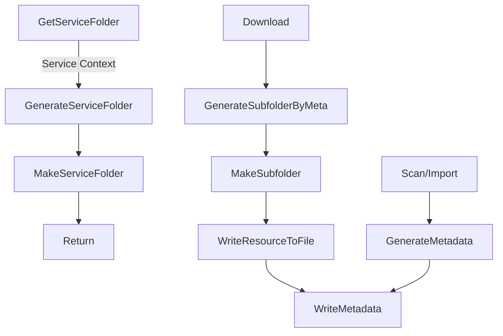
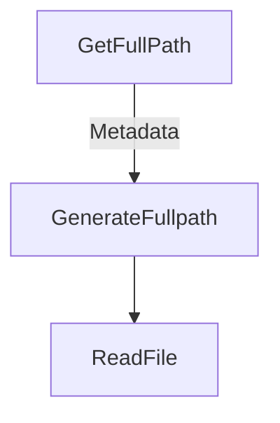

# Storage Design

Basic idea: every micro service will share a root volume/mount point.

* `storage path` will be a config section and auto convert to absolute path.
* `service path` will be calatued by the `service meta` and returned as absolute path.
* `relative path` will be storaged in metadata `url` as `relative://relative/path/...` ;
* `service relative path` and `service managed path` will be extra keys in `document` metadata section;

```
|                                full/absolute path                               |
|       storage path     |                    relative path                       |
|                service path                 |        service managed path       |
|       storage path     |  service relative  |  service managed path | files...  |
/data/save/volume/or/path/service/meta/context/service/managed/subpath/filename.ext
```

For grabber workers, it will ask Storage service and get their "service path" folder, and manage subfolder themselfs, report downloaded file's relative path to meta service.

For parse workers, it need to ask Storage service for the metadata "full path", and try to read the file depended and update the metadata.

To import files already downloaded, the scanner worker will try to copy/link file/folder to storage path, then read every file/folder info and generate metadata for indexing.

    IMPORTANT: If these microservers running in different containers, need ensure that the "data storage volume" are shred between containers and mounted to the same mountpoint. Otherwise these workers cannot read/write these files.

## Save Resource Flow



## Load Resource Flow

