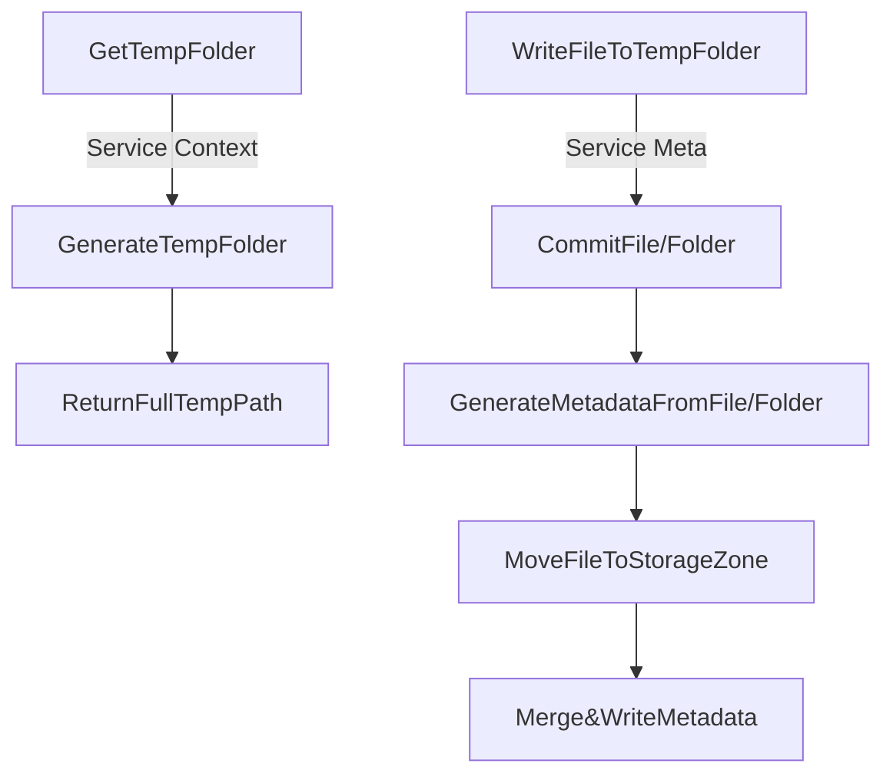
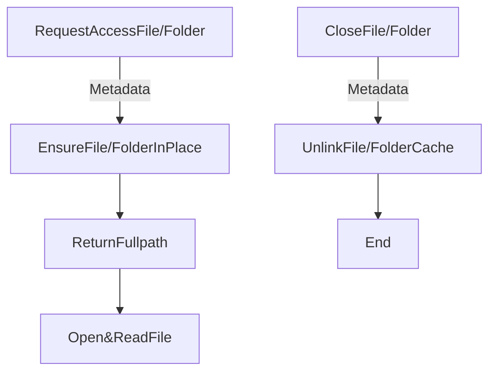

# Storage Design

Basic idea: every micro service can share a root volume/mount point served by storage service.
设计基础：所有微服务对文件的访问都是基于存储服务提供的绝对路径进行。

存储服务具备以下接口：

1. 获取临时写入路径以供提交；
2. （由微服务写入文件到临时路径后）新文件提交；
3. 既有文件读取（根据Meta ID/相对路径/URL等索引）返回当前微服务可以读取的绝对路径；
4. 文件删除；

存储服务基于以下前提设计：

1. 一旦文件提交，所有微服务器只能修订其 Meta Data而无法再修改其内容本身；
2. 每个微服务尝试借阅 Meta 指代文件/文件夹时，最终会在自身的 Cache 目录中读取到该文件；而对该拷贝的修改并不会再次反应到 Storage 里；
3. 通过管理 Cache 来实行权限管理，每个微服务可借阅的文件仅限其自身服务请求且可以读取的文件范围；
4. 存储服务自身负责文件的实际存取方式和配置（基于磁盘/NFS/S3 Bucket等等），提供给微服务的始终是当前微服务直接能访问的全路径；
5. 被提交文件的文件名最终只会在 MetaData 里，与实际读入的文件名毫无关系，除非请求使用原始文件名/相对路径缓存到本地；
6. 如果需要保持目录结构，则提交整个目录；目录会变成一个 MetaData 存在，并引用对应文件的 Meta ID；请求目录时，会根据请求重建其结构，但不会主动放入其中包含的文件，除非请求包含指定文件；
7. 所有文件均为懒加载，仅在实际请求的时候可能被拷贝/链接/下载到微服务可存取目录中，并在微服务销毁/文件读取关闭文件时清理；

微服务上传文件时将会这样计算文件Meta：

```
|             fullpath/absolute path                  |
| managed by storage |   relative path    | filename  |
/storage_managed_path/service_created_path/filename.ext
```

如果是使用工具从 Storage 服务外部存储提交文件，则一样需要指定根路径以计算相对路径，否则将会以当前路径计算或者仅提交文件名。

微服务借阅文件/文件夹将会得到的回应：

```
|             fullpath/absolute path                 |
| managed by storage |   relative path   | filename  |
/storage_managed_path/service_cached_path/filename.ext
```

## Save Resource Flow



## Load Resource Flow



## 存储服务模块分割

存储服务分为持有文件的 Service，和微服务调用的 Client 两部分。

### Storage Service 

服务自身需要维护文件存储的相关配置（包括本地/远程/云端etc）及维护自身发现。每个服务可以配置不同后端。

每个 Storage 服务均可选择自身存储/读取文件的方式，但务必保持其二进制内容存取一致。
每个 Storage 服务应该尽可能使用自己的额外存储（数据库/服务/文件/etc）来记录被提交文件在自身内部存储位置，而非直接提交进入 Metadata。

### Storage Cache

在每个部署环境里，只要有文件存取需求，就需要部署 Cache 服务，以便直接从本地/异地获取文件内容；
如果同一文件被本地多个微服务请求，则 Cache 将使用链接方式将文件分发到对应微服务目录中，从而避免多次下载/复制操作；
基于该设计，尽量让本地所有微服务使用同一个存储卷作为 Cache 效果最好。

### Storage Client

微服务使用的 Storage Client 来与 Storage Service 进行交互，进而获得文件本身。 
Client 本身仅维护当前微服务Cache目录下文件内容。