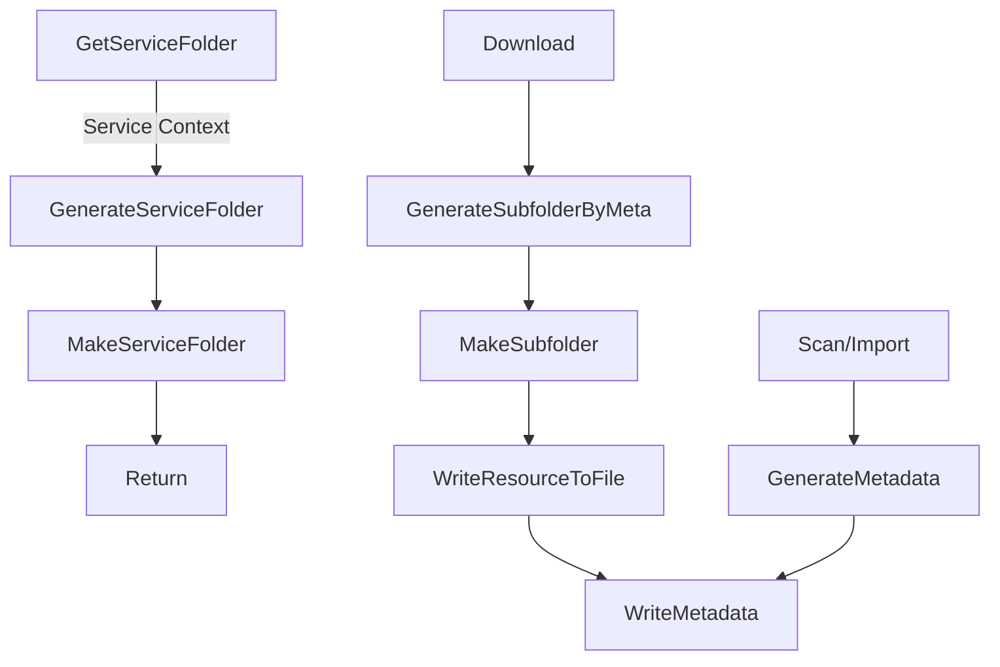
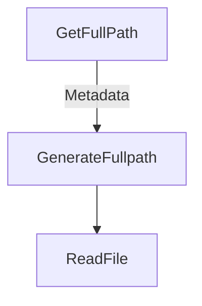

# Storage Design

Basic idea: every micro service will share a root volume/mount point.

For grabber workers, it will ask Storage service and get their "write" folder, and manage the folder struct themselfs, report downloaded files' metadata to meta service.

For parse workers, it need to ask Storage service for the metadata "real path", and try to read the file depended and update the metadata.

To import files already downloaded, the scanner worker will try to read every file/folder and generate metadata for indexing.

    IMPORTANT: If these microservers running in different containers, need ensure that the "data storage volume" are shred between containers and mounted to the same mountpoint. Otherwise these workers cannot read/write these files.

## Save Resource Flow

## Load Resource Flow

