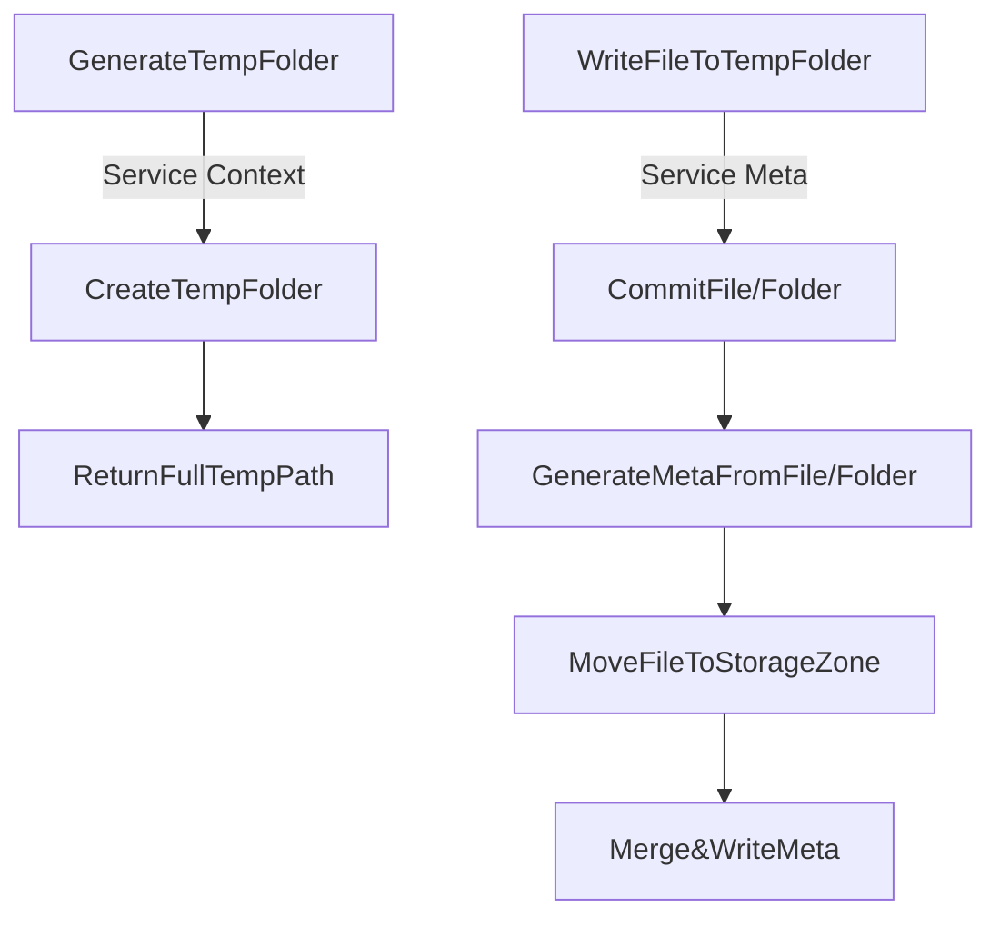
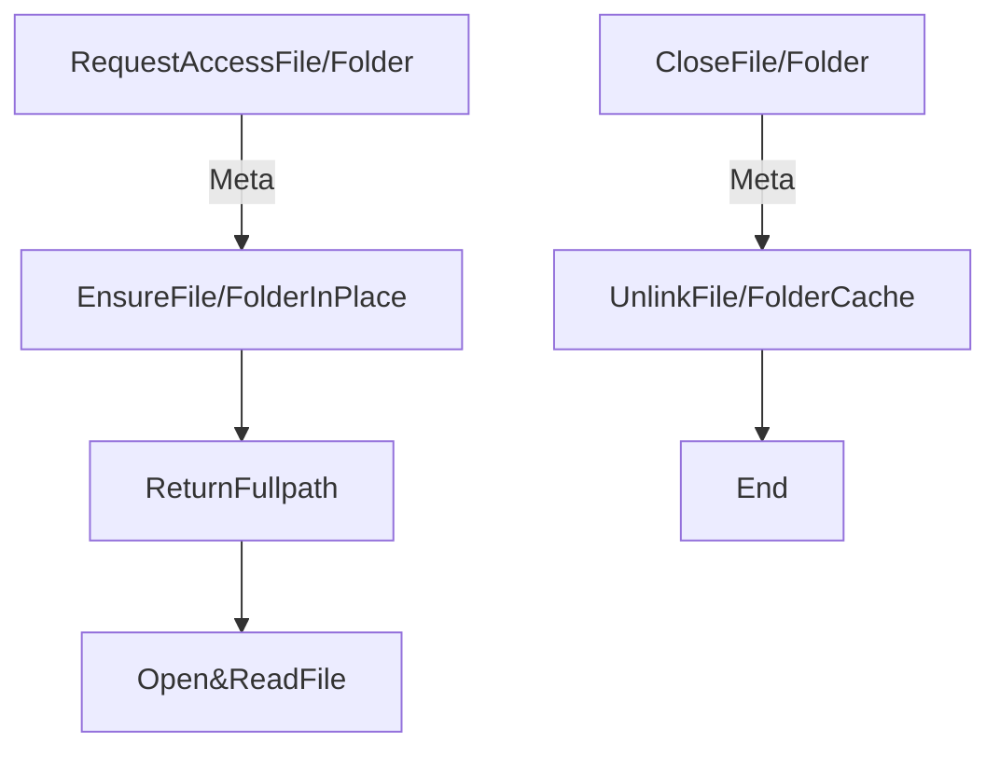

# Storage Design

Basic idea: every micro service using file/folders served by storage service.
设计基础：所有微服务对文件的读取都是基于存储服务准备的文件进行；所有微服务的文件写入都是提交到存储服务，并不能再更改。

存储服务具备以下接口：

1. 提交文件/文件夹；
2. 借阅文件/文件夹；
3. 销毁文件/文件夹；

存储服务基于以下前提设计：

1. 一旦文件提交，所有微服务器只能修订其 Meta 而无法再修改其内容本身；
2. 微服务借阅 Meta 包含的文件/文件夹时，最终会在自身的 Cache 目录中读取到该文件；而对该拷贝的修改并不会影响到已提交文件；
3. 文件 Meta 可限制能访问的微服务，不在描述中的微服务无法j借阅该文件；
4. 存储服务自身负责文件的实际存取方式和配置（基于磁盘/NFS/S3 Bucket等等），提供文件的基本三操作，由 Agent 代理给各个微服务；
5. 被提交文件的文件名最终只会在 Meta 里，与实际读入的文件名毫无关系，除非请求使用原始文件名/相对路径借阅到本地；
6. 如果需要保持目录结构，则提交整个目录；目录会变成一个 Meta 存在，并引用对应文件的 Meta ID；请求目录时，会根据请求重建其结构，但不会主动放入其中包含的文件，除非请求包含指定文件；

微服务上传文件时将会这样计算文件Meta：

```
|            fullpath/absolute path               |
|   relative root  |          relative path       |
|   relative root  |                  | filename  |
/relative_root_path/some_other_folders/filename.ext
```

如果是使用工具从 Storage 服务外部存储提交文件，则一样需要指定根路径以计算相对路径，否则仅提交文件名。

微服务借阅文件/文件夹将会得到的回应：

```
|                                fullpath/absolute path                                    |
| managed by storage |  subfolder for service |  meta based folder |  borrowed file/folder |
/storage_managed_path/cache_folder_for_service/borrowed_meta_folder/borrowed_file.ext/folder
```

## Save Resource Example Flow



## Load Resource Example Flow



## 存储服务模块分割

存储服务分为持有文件的 Storage Service 与 微服务直接调用的 Storage Client 组成。

### Storage Service 

服务自身需要维护文件存储的相关配置（包括本地/远程/云端etc）及维护自身发现。每个服务可以配置不同后端。

Storage Service 均可选择自身存储/读取文件的方式，但务必保持其二进制内容存取一致。
Storage Service 应该使用自己的额外存储（数据库/服务/文件/etc）来记录被提交文件在自身内部存储位置，而非提交到文件 Meta。
Storage Service 应该明确自身对于访问某一Meta对应文件的实际消耗（磁盘、网络、延迟等），消耗越高则Agent使用优先级越低；

### Storage Client

微服务使用的 Storage Client 来进行文件的 提交/借阅/删除 操作；
Client 需维护当前微服务 Cache 目录下存放的文件内容，并根据需要进行清理；
Client 应尽可能使用消耗最低的 Storage 服务（最佳实践：本地）来进行文件操作；
