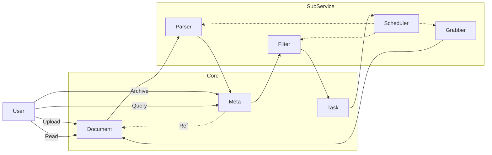
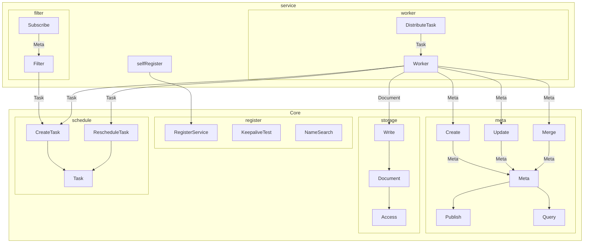

# 系统设计

1. 系统基本存储/检索单位为 `元数据` (Meta) ，它是一个将 `原始资料` （Document)（HTML/DOC/PDF/IMAGE/VIDEO/...) 经过系统处理、解析、摘要之后生成的一份 Key/Value 字典；
2. `Meta` 数据可以包含其它 `Meta`/`Document` 的关联引用；
3. `Document` 包含抓取工具对一个 `原始 URL` 的抓取原始结果；
4. 分析工具对 `Document` 进行解析并生成/更新对应的 `Meta` 数据；
5. 系统由 `Core` 服务和可扩充的 `Sub Service`(下文简称 `Service`)共同工作；
6. `Core` 负责基本的 `Meta` `Document` 和 `Task` 数据相关服务；
7. `Service` 负责根据服务自身设计范围完成子项任务；
8. `Meta` 、 `Document` 和 `Task` 在创建、 修订、删除等操作前后，会向消息管线发送异步消息，各个 `Service` 可以订阅；
9. `Task` 集中设计原因：服务之间可以通过该方式进行异步互相调用；同时服务自身可以在升降版本的时候有效管理断点；

## Data Flow

## Meta & Document

1. Meta&Document 是系统管理的原子数据；
1. Meta 是一个经过各个 Worker 处理后，可以检索的 Key/Value 字典；
1. Document 是原始获取的内容（文本/媒体/等）；
2. 每个 Document 必然有至少一个对应的 Meta 数据来描述其内容摘要；
3. Meta 可以互相关联，来表述其从属关系；

## Task & Schedule

1. Task 是 Worker 处理的最小事务；Task 主要参数： Worker(Group)/Meta ID(Nullable)/Task Name(Route)/Task Params（使用二进制方式存储，并按照原始内容传递）；
2. Task 可以从 Meta Insert/Update/Select 等操作中生成；其中 Meta Insert/Update 会通过消息管线实时广播，而 Meta Select 可以通过 API 查询后批量处理；
3. Schedule 可以通过排期生成对应 Task；

## Worker & Service

3. 一个 Service 是 squirrel 里的一组扩充服务，常见包括以下组件：
1. 一个 Worker 代表一个实际进行 Meta 相关 Document获取/解析/筛选 等事务的 Exectuable (服务/进程/线程/函数/etc)；
2. Filter 负责订阅消息过滤和 Task 生成；
3. Register 注册服务端点及相关参数；

# 核心组件(Core)

## Meta

负责 Meta 相关事务：

1. 存储/更新 Meta 数据；
2. 分发 Meta 消息；
3. 提供 Meta 检索接口；

## Schedule 

Schedule 负责 Task 相关事务：

1. 创建 Task；
2. (根据时间表/繁忙程度/配置额度等)调度 Task 进入执行状态；
3. 接收 Task 执行结果（成功/失败/重新调度）；
4. （定期）清理 Task 列表；
5. Task 调度/查询 接口；

## Register

Register 负责 Service 相关事务：

1. Service Register；
3. Service Name Search / Poll；
2. Service Route；
4. Service keepalive test；